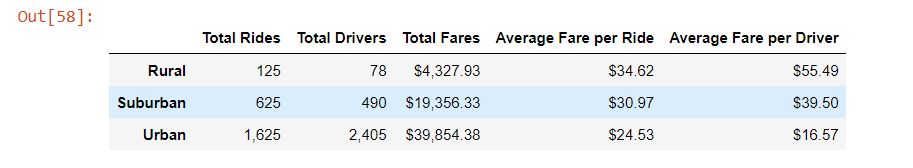
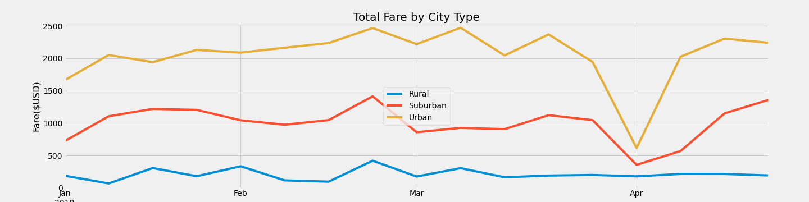

# PyBer_Analysis

## Overview of Project
The purpose of this project was to create a professional data visualization for PyBer, a new rideshare app, to present to the CEO of V.Isualize. The goal was to illustrate any relationships or lack-there-of between fares and the type of city (rural, urban, suburban) where the ride occured and the date/time of the ride.This task requirred the use of matplotlib in python and the development of a summative dataframe, both of which are included in the supplemental results section.

## Results
The first summative dataframe, pictured below, depicts the clear impact of supply and demand. Likely due to the lower population in rural areas, less drivers can also be found. Because the supply of drivers is low, their average fare is roughly $10 more than those in urban areas. The differential is porportionate, being the from rural-suburban-urban there is roughly a 5 dollar difference between the various locations. 

More specific information regarding the utilization of the PyBer rideshare app across the three different city types can be seen in the relationship between weekly fares and the time of a ride in the image below. The chart depict a time frame from 1/1/2019 to 4/29/2019. In this time frame, rural cities saw fares reach their highest aroudn the end of February and early March reaching close to 2,500. Rural city fares bottomed out at the start of April (roughly 750) and were lowest around this time. Suburban cities also saw a dip in fares during this time; however, it was not as significant considering their lower fare rate in general. It also followed a similar trend to rural cities by reaching its highest fares in late February (roughly 1,500). Overall, suburban areas started to resemble the more consistent pricing enjoyed by urban cities, as they were typically between 750-1,500. Urban cities were quite consistent, as fares ranged between 0-500 throughout the four month period. There was a similar jump in pricing at late February, but not as significant as it was in the other two contexts. 

## Summary

Overall the most consisten pricing for riders and drivers can be found in urban cities, as this is where demand and supply are most consistent. It is intuitive that as users of the rideshare app start to expand into suburban and rural locations fares for drivers will continue to increase alongside remoteness. The time/date of rides should also be considered, as late February and early March appear to be a lucrtive season for drivers as it is when fares are highest. Riders in suburban and rural areas could see substantial decreasesin prices around the start of April. 
